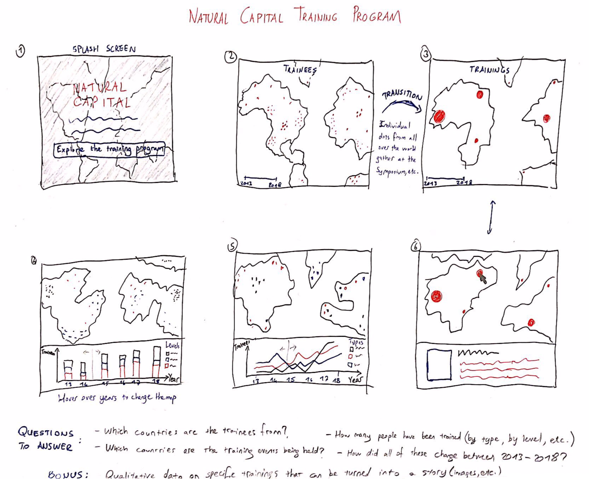

# Natural Capital Project Training Program Visualization

## Target Audience
Mainly NatCap partners/affiliates, but also anyone interested in the program, e.g. people at the Symposium.

## Objective
NatCap's training program teaches ecosystem services approaches to multiple audiences around the world. They want better ways of viewing the stats of their performances. The main questions that they want answered by the interface are:

- What is the total attendance (in # people/training and in trainee/days) per year, and specifically per training type? What about per training level?
- How many and which countries are we trained in? (Using a map)
- Which/how many different countries are the trainees from? (Map)
- What are some specific examples of the training sessions? Highlight a couple of specific trainings with qualitative data on training materials and pictures. (Useful for storytelling)

## Initial Sketch

## Wireframe in Tableau

